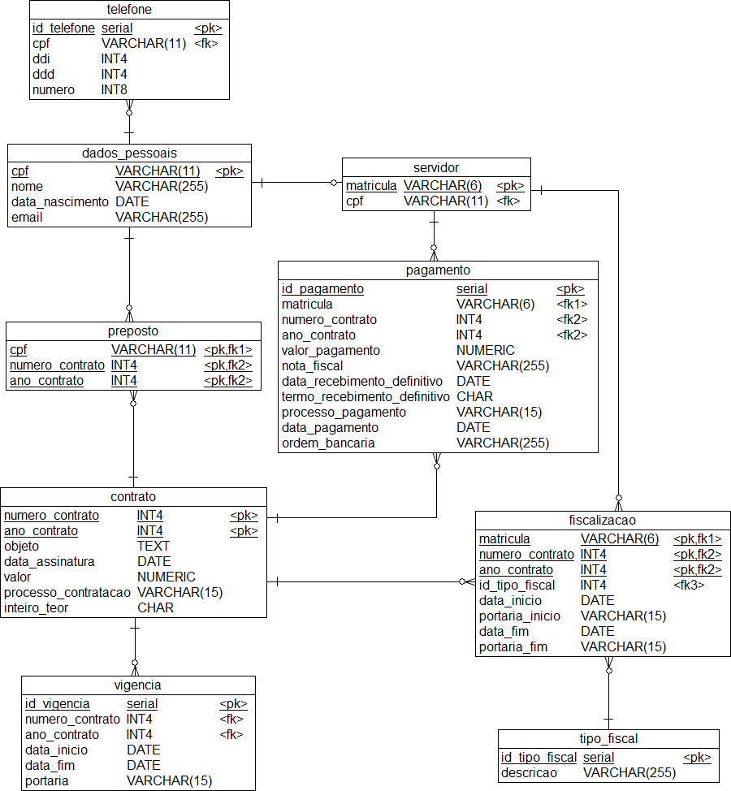
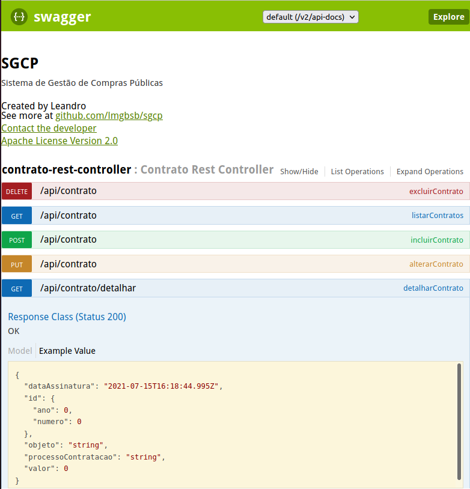

# SGCP - Sistema de Gestão de Contratações Públicas

Os princípios que regem os atos da administração pública são legalidade, impessoalidade, moralidade, eficiência e **publicidade**.

A exigência de licitação nas contratações públicas é feita pela Carta Magna, sendo regulamentada pela Lei nº 8.666/93. O artigo 3º dessa legislação destaca a importante função da licitação ao conferir isonomia de tratamento entre os candidatos, conferindo a impessoalidade necessária para que se eleja a proposta que melhor atenda aos interesses públicos, independente do proponente. A licitação garante, portanto, o respeito aos “[...] princípios básicos da legalidade, da impessoalidade, da moralidade, da igualdade, da publicidade, da probidade administrativa, da vinculação ao instrumento convocatório, do julgamento objetivo e dos que lhes são correlatos”.

Nota-se que, tanto na disposição constitucional, quanto no artigo 3º da Lei nº 8.666/93, há a preocupação em conferir publicidade às contratações públicas, de modo que se possa controlar os atos administrativos. Importante destacar a necessidade de publicidade e transparência dos atos da administração pública, até mesmo como pressuposto para lhes conferir legitimidade, bem como manter a moralidade administrativa em relação a essas contratações. 

:heavy_check_mark: Esse projeto pessoal surgiu a partir da dificuldade de obtenção de informações simples sobre as contratações de qualquer órgão público. Esses dados são públicos, porém disponibilizados de forma não estruturada no Diário Oficial da União - DOU.

:heavy_check_mark: O objetivo desse projeto é permitir a fiscalização pela sociedade das contratações públicas, desde a licitação até os pagamentos dos contratos por meio da disponibilização de dados para a geração de informações e conhecimento a respeito das licitações e contratações de determinado órgão público.

:heavy_check_mark: O público alvo desse sistema são os servidores do próprio órgão publico e a população em geral. Os servidores terão à sua disposição uma ferramenta para auxiliá-los na fiscalização das contratações, enquanto que a sociedade poderá acompanhar em um único portal todas as contratações por meio dos seus editais, valores, contratos e pagamentos.

As principais informações a serem disponibilizadas por meio de relatórios e API's são:

* Relação de editais abertos por intervalo de tempo
* Busca de contratos por objeto, número, intervalo de datas ou intervalo de valor
* Detalhes de uma licitação (Número, Objeto, Data de abertura, Histórico do andamento, Grupos, Itens, Vencedores, Contratos, Valor total, Pagamentos, Fiscais)
* Relação de contratos de uma determinada empresa com um órgão público
* Relação de pagamentos de cada contrato
* Relação de contratos fiscalizados por determinado servidor
* Relação de contratos que estão próximos ao vencimento (6 meses)
* Restos a pagar de um contrato

:point_right: A execução de um contrato é sempre acompanhada e fiscalizada por 1 (um) ou mais fiscais do contrato, representantes da Administração especialmente designados conforme requisitos estabelecidos no art. 7º desta Lei, ou pelos respectivos substitutos, cf. Art. 117. da Lei 8.112.

:point_right: Preposto é o representante do contratado na execução do contrato, cf. Art. 118 da Lei 8.112.

:point_right: O objeto do contrato será recebido definitivamente, por servidor ou comissão designada pela autoridade competente, mediante termo detalhado que comprove o atendimento das exigências contratuais, cf. Art. 140 da Lei 8.112.

As principais tecnologias utilizadas no desenvolvimento são

- JavaScript
- Maven
- Java
- Spring Boot
- JPA
- Swagger
- Junit 5
- Jakarta Bean Validation
- MySQL

A codificação observará os padrões de código fonte do [Spring Framework Code Style Guide](https://github.com/spring-projects/spring-framework/wiki/Code-Style).

O desenvolvimento do projeto será orientado pelas diretrizes do [twelve-factor app](https://12factor.net/), uma  metodologia para construir softwares-como-serviço que:

- Usam formatos declarativos para automatizar a configuração inicial, minimizar tempo e custo para novos desenvolvedores participarem do projeto;
- Tem um contrato claro com o sistema operacional que o suporta, oferecendo portabilidade máxima entre ambientes que o executem;
- São adequados para implantação em modernas plataformas em nuvem, evitando a necessidade por servidores e administração do sistema;
- Minimizam a divergência entre desenvolvimento e produção, permitindo a implantação contínua para máxima agilidade;
- E podem escalar sem significativas mudanças em ferramentas, arquiteturas, ou práticas de desenvolvimento.

<!---
Um levantamento inicial de requisitos originou o seguinte diagrama de classes:

-->

:warning: Tendo em vista o tamanho e a complexidade do projeto, bem como a possibilidade de dividi-lo em partes íntegras que tenham valor por si só, optou-se então pela divisão em dois projetos que posteriormente serão integrados. 

A primeira parte cuidará da execução e ficalização do contrato

A segunda parte cuidará da licitação e da formalização do contrato

O Diagrama de Entidades e Relacionamentos da primeira fase:

Os endpoints para listar, incluir, excluir, alterar e detalhar contratos podem ser
conferidos e testados pelo [Swagger](http://localhost:8080/swagger-ui.html#/contrato-rest-controller)

Os microserviços desse projeto utilizarão o formato JSON como formato de serialilzação de todos os dados de entrada e saída dos serviços e seguirão o modelo de maturidade [Richardson Maturity Model](http://mng.bz/JD5Z), conforme descrito por [Martin Fowler](https://martinfowler.com/articles/richardsonMaturityModel.html): 

- As informações serão estruturadas na forma de recursos, que são identificados e recebem um endereço, permitindo a manipulação de recursos individuais. Cada recurso disponibiliza um conjunto de operações que são aplicadas sobre os próprios recursos.
- Os microserviços respeitarão a semântica do protocolo utilizado pela API. As quatro operações básicas disponibilizadas pelo protocolo HTTP são GET, POST, PUT e DELETE, o que implica que recursos devem ser criados através da operação POST, alterados por PUT, recuperados por GET e removidos por DELETE. Esse nível de maturidade exige também o uso correto de status code, para descrever corretamente as respostas das requisições realizadas.
- Os microserviços implementarão o conceito de [hipermídia como plataforma de estado da aplicação](https://en.wikipedia.org/wiki/HATEOAS), que adiciona controles hipermídia às representações, trazendo ainda mais flexibilidade na medida em que possibilita mudanças de ambiente de execução em operações de cliente e na API.

