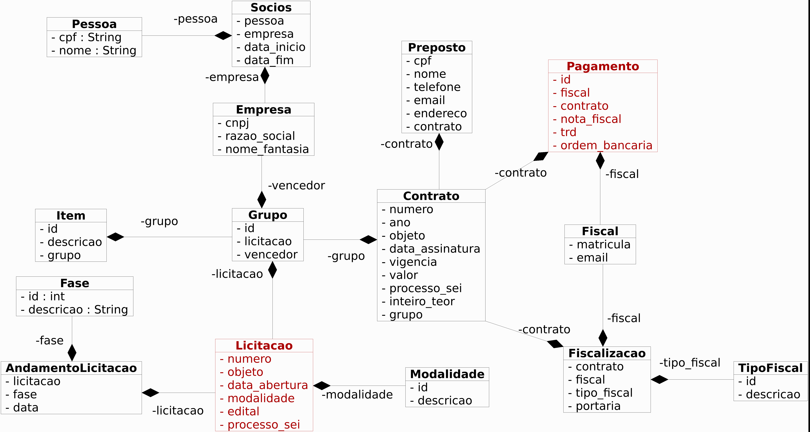
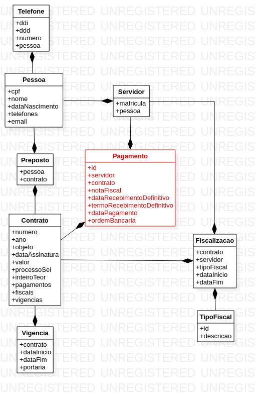
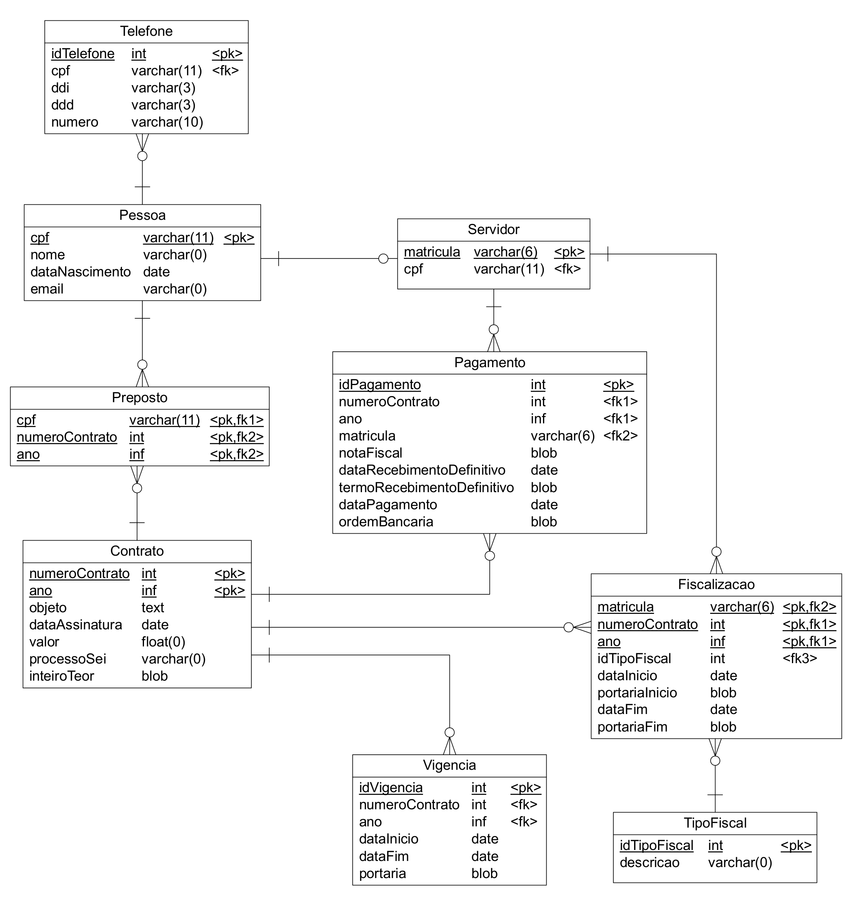

# SGCP - Sistema de Gestão de Contratações Públicas

Esse projeto surgiu a partir da dificuldade de obtenção de informações simples sobre as contratações de qualquer órgão público. Esses dados são públicos, porém disponibilizados de forma não estruturada no DOU.

O objetivo desse projeto é permitir a fiscalização pela sociedade das contratações públicas, desde a licitação até os pagamentos dos contratos por meio da disponibilização de dados para a geração de informações e conhecimento a respeito das licitações e contratações de determinado órgão público.

O público alvo desse sitema são os servidores do próprio órgão publico e a população em geral, que poderá acompanhar em um único portal todas as contratações por meio dos seus editais, valores, contratos e pagamentos.

As principais informações a serem disponibilizadas são

* Relação de editais abertos por intervalo de tempo
* Relação de contratos fiscalizados por determinado servidor
* Busca de contratos por objeto, número, intervalo de datas ou intervalo de valor
* Detalhes de uma licitação (Número, Objeto, Data de abertura, Histórico do andamento, Grupos, Itens, Vencedor, Contrato, Valor total, Pagamentos, Fiscais)
* Relação de contratos de uma determinada empresa com um órgão público
* Relação de contratos que estão próximos ao vencimento (6 meses)
* Relação de pagamentos de cada contrato

As principais tecnologias utilizadas no desenvolvimento são

- Maven
- Java
- Spring Boot
- Thymeleaf
- MySQL

Um levantamento inicial de requisitos originou o seguinte diagrama de classes:

Tendo em vista o tamanho e a complexidade do projeto, bem como a possibilidade de dividi-lo em partes íntegras que tenham valor por si só, optou-se então pela divisão em dois projetos que posteriormente serão integrados. 

A primeira parte cuidará da execução e ficalização do contrato

A segunda parte cuidará da licitação e da formalização do contrato

O Diagrama de Entidades e Relacionamentos:

A execução do contrato deverá ser acompanhada e fiscalizada por 1 (um) ou mais fiscais do contrato, representantes da Administração especialmente designados conforme requisitos estabelecidos no art. 7º desta Lei, ou pelos respectivos substitutos, cf. Art. 117. da Lei 8.112.

Preposto é o representante do contratado na execução do contrato, cf. Art. 118 da Lei 8.112.

O objeto do contrato será recebido definitivamente, por servidor ou comissão designada pela autoridade competente, mediante termo detalhado que comprove o atendimento das exigências contratuais, cf. Art. 140 da Lei 8.112.

